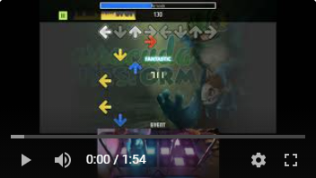
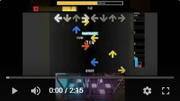
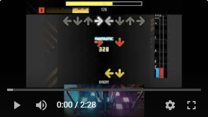

# Examples
Below are some examples of singles charts that have been converted into doubles charts.

## Technical Charts
### [Barracuda](http://htmlpreview.github.io/?https://github.com/PerryAsleep/Fumen/blob/master/StepManiaChartGenerator/docs/Visualizations/Barracuda/Barracuda-Challenge-ssc.html) [11] (Valex's Magical 4-Arrow Adventure 10)
The original chart is authored by J. Berkowitz. This chart has crossovers, inverts, and footswaps.

### [Killer Bee](http://htmlpreview.github.io/?https://github.com/PerryAsleep/Fumen/blob/master/StepManiaChartGenerator/docs/Visualizations/Killer%20Bee/Killer%20Bee-Challenge-ssc.html) [11] (Valex's Magical 4-Arrow Adventure 10)
The original chart is authored by J. Berkowitz. This chart has a large number of brackets.

### [The Love Bug](http://htmlpreview.github.io/?https://github.com/PerryAsleep/Fumen/blob/master/StepManiaChartGenerator/docs/Visualizations/The%20Love%20Bug%20(YUC%27e%20Remix)/The%20Love%20Bug%20(YUC%27e%20remix)-Challenge-ssc.html) [12] (Valex's Magical 4-Arrow Adventure 10)
The original chart is authored by J. Berkowitz. This chart has footswaps, brackets, and crossovers.

### [Zora](http://htmlpreview.github.io/?https://github.com/PerryAsleep/Fumen/blob/master/StepManiaChartGenerator/docs/Visualizations/(NG%20-%2011)%20Zora/zora-Challenge-sm.html) [11] (ECFA 6 - Hard FA)
The original chart is authored by mute. This chart has brackets, double stepping, footswaps, crossovers, and inverts.

## Stamina Charts

### [Blue Sunshine](http://htmlpreview.github.io/?https://github.com/PerryAsleep/Fumen/blob/master/StepManiaChartGenerator/docs/Visualizations/Blue%20Sunshine%20(Original%20Mix)/Blue%20Sunshine%20(Original%20Mix)-Challenge-sm.html) [13] (TranceMania)
The original chart is authored by t0ni. A simple stamina chart at a comfortable bpm.

### [Clarity](http://htmlpreview.github.io/?https://github.com/PerryAsleep/Fumen/blob/master/StepManiaChartGenerator/docs/Visualizations/%5BGOBOW%5D%20Clarity%20feat.%20Foxes%20(DJ%20Noriken%20Remix)/Clarity%20feat.%20Foxes%20(DJ%20Noriken%20Remix)-Challenge-sm.html) [13] (Enjoy Stamina Pack)
The original chart is authored by GOBOW. A simple stamina chart at a comfortable bpm.

### [Let Me Fly on Tokyo Night](http://htmlpreview.github.io/?https://github.com/PerryAsleep/Fumen/blob/master/StepManiaChartGenerator/docs/Visualizations/Let%20Me%20Fly%20on%20Tokyo%20Night/letmeflyontokyonight-Medium-ssc.html) [11] (Eurobeat Is Fantastic - Second Stage)
The original chart is authored by Rems. This is the Medium chart.

## Simple Charts

### [Come & Get It](http://htmlpreview.github.io/?https://github.com/PerryAsleep/Fumen/blob/master/StepManiaChartGenerator/docs/Visualizations/Come%20%26%20Get%20It/Come%20%26%20Get%20It-Challenge-sm.html) [10] (Mudkup 7th Gen)
The original chart is authored by Mudkyp.

### [Fire](http://htmlpreview.github.io/?https://github.com/PerryAsleep/Fumen/blob/master/StepManiaChartGenerator/docs/Visualizations/Fire/fire-Challenge-ssc.html) [9] (Mute Sims X)
The original chart is authored by mute.

### [Que Veux-Tu](http://htmlpreview.github.io/?https://github.com/PerryAsleep/Fumen/blob/master/StepManiaChartGenerator/docs/Visualizations/Que%20Veux-Tu%20(Madeon%20Remix)/queveuxtu-Challenge-sm.html) [10] (Mute Sims 9)
The original chart is authored by mute.

## Easy Charts (No Bar)

### [PAPAYAPA BASS](http://htmlpreview.github.io/?https://github.com/PerryAsleep/Fumen/blob/master/StepManiaChartGenerator/docs/Visualizations/PAPAYAPA%20BASS/PAPAYAPA%20BASS-Medium-sm.html) [7] (BemaniBeats 6)
The original chart is authored by Chief Skittles. This is the Medium chart.

