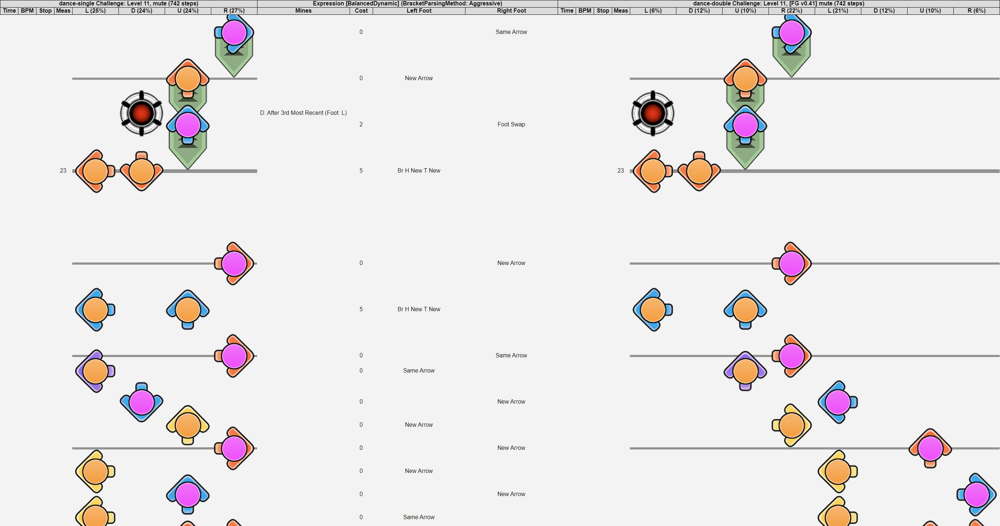

# Visualizations
Visualizations are optional html documents that can be generated per chart that show the original chart, key [ExpressedChart](HowItWorks.md#expressedCharts) information, and the [PerformedChart](HowItWorks.md#performedCharts). The charts are rendered with orange circles to indicate Left foot steps, and pink circles to indicate Right foot steps. Visualizations are intended to be used for debugging exports and getting a quick glance of a generated chart.

See the [Configuration](Config.md) guide for controlling Visualization behavior.

See the [Examples](Examples.md) page for example charts and their Visualizations.

With the exception of [l.png](..\html\src\l.png) and [r.png](..\html\src\r.png) all assets used in Visualizations are taken from [StepMania](https://github.com/stepmania/stepmania). Most assets are from the [dance default NoteSkin](https://github.com/stepmania/stepmania/tree/5_1-new/NoteSkins/dance/default).